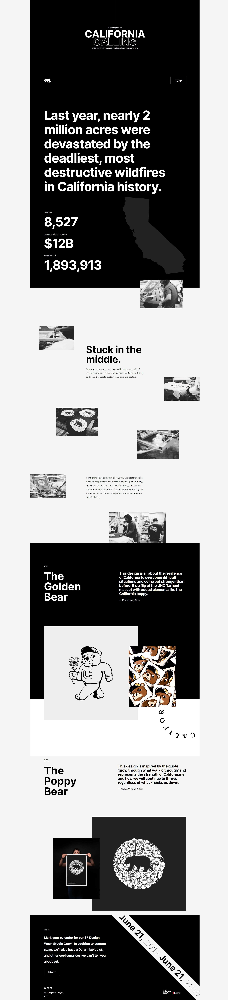
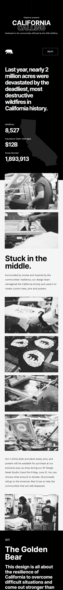

# Project California Calling – HTML und (S)CSS Abschlussprojekt

## Beschreibung

Diese responsive Single-Page-Website wurde im Rahmen eines Coding-Bootcamps bei supercode.de erstellt und war das Abschlussprojekt für den HTML- und (S)CSS-Teil. 
Es handelt sich um eine Info-Website über die tödlichsten und zerstörerischsten Waldbrände in der Geschichte Kaliforniens.
Das San Francisco Design Team hat während der SF Design Week im Jahr 2019 diese Website präsentiert, 
um Spenden mit Merchandising-Artikeln zu sammeln. Der gesamte Erlös ging an das Amerikanische Rote Kreuz, um den Gemeinden zu helfen.

## Tools/Technologien
- HTML5
- SCSS

## Figma Vorlage
Die Figma Vorlage findest du hier: [Figma Vorlage](https://www.figma.com/file/4PgsprjgPpKNSAg6yjHlCM/css_vertiefung_projects_level_3_9-(Copy)?type=design&node-id=0-1&mode=design&t=T8O8s8BsxbmRboyk-0)

## Screenshots

### Website

### Mobile Website

## GitHub Live Vorschau

Du findest eine Live Vorschau auf GitHub: [GitHub Live Vorschau](https://w1tch3r-code.github.io/project_california_calling/)

## GitHub Repository

Du findest das gesamte Projekt auf GitHub: [GitHub Repository](https://github.com/w1tch3r-code/project_california_calling)

## Anmerkungen

- Dieses Projekt wurde im Rahmen eines Coding-Bootcamps bei supercode.de erstellt.
- Die README.md-Datei dient auch als Bewerbungsunterlage und präsentiert meine Fähigkeiten in der Webentwicklung.
